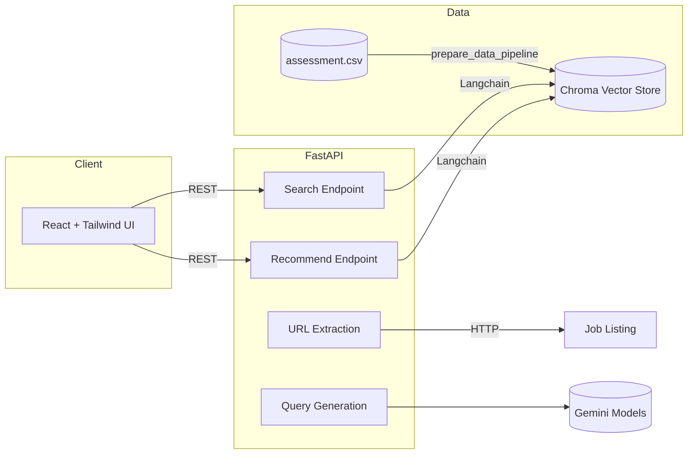

<div align="center">

# 🧩 Smart Assessment Recommendation System


AI-powered assessment recommendations that connect hiring teams with the right SHL evaluations in seconds.

</div>

---

## 🧭 Quick Links

- [System Overview](#-system-overview)
- [Architecture](#-architecture)
- [Getting Started](#-getting-started)
- [REST API Reference](#-rest-api-reference)
- [Data & Vector Store](#-data--vector-store)
- [Benchmarking & Quality](#-benchmarking--quality)
- [Deployment](#-deployment)
- [Additional Documents](#-additional-documents)

---

## 🌟 System Overview

The Assessment Recommendation System ingests HR job requirements—either as free-form text or job description URLs—and returns the most relevant SHL assessments. Behind the scenes the platform combines:

- 🌐 A FastAPI backend that orchestrates extraction, enrichment, and semantic search
- 🔍 A Chroma vector database populated from curated SHL catalog data
- 🤖 Google Gemini (Generative AI) for query rewriting and embeddings
- 🖥️ A responsive React/Vite frontend for recruiters and talent partners

Use it to quickly tailor assessment bundles by role seniority, skills, duration constraints, or delivery preferences (remote vs. on-site, adaptive IRT, and more).

### Feature Highlights

- Dual input mode: natural language text or job URL scraping
- Filter-aware search that understands duration, job level, skills, and delivery attributes
- Clear results table with deep links to SHL product pages
- Sample prompts and helpful feedback states for end-users
- Benchmark suite to track retrieval quality over time

---

## 🗂️ Repository Layout

```
.
├── backend/
│   ├── app/                # FastAPI application modules
│   ├── database/vector_db  # Persisted Chroma store
│   ├── scripts/            # Tooling (benchmarks, utilities)
│   ├── assessment.csv      # Source catalog snapshot
│   ├── requirements.txt    # Python dependencies
│   └── render.yaml         # Render deployment blueprint
├── frontend/
│   ├── src/                # React components & types
│   ├── public/             # Static assets
│   └── package.json        # Frontend dependencies & scripts
├── docs/
│   └── SRS.md              # Full Software Requirements Specification
├── OPTIMIZATION.md         # Notes on performance improvements
└── Dev-Phase-outline.mermaid
```

---

## 🏛 Architecture



### Key Components

- **Frontend (React + TypeScript)**: Collects user requirements, calls the backend, and renders tabular recommendations with supporting metadata.
- **Backend (FastAPI + LangChain)**: Routes incoming queries through extraction (`BeautifulSoup`), query generation (Gemini), and semantic retrieval (Chroma + GoogleEmbeddings).
- **Vector Store (Chroma DB)**: Stores assessment embeddings enriched with detailed metadata for filtering (job levels, languages, test types, delivery modes, etc.).
- **Benchmarks & Evaluation**: `backend/scripts/benchmark.py` computes Recall@K and MAP@K for curated scenarios.

---

## 🚀 Getting Started

### Prerequisites

- Python 3.11+
- Node.js 20+ (tested with Vite 6)
- npm 10+
- Google Gemini API access (`GOOGLE_API_KEY`)

### 1. Clone & bootstrap (once per machine)

```powershell
git clone https://github.com/param2610-cloud/Assessment-Recommendation-Engine.git
cd Assessment-Recommendation-Engine
```

### 2. Backend setup (`backend/`)

```powershell
cd backend
python -m venv .venv
.\.venv\Scripts\activate
pip install -r requirements.txt
Copy-Item .env.example .env  # then add your GOOGLE_API_KEY
python main.py --prepare assessment.csv  # builds/refreshes the Chroma store
python main.py --api  # starts FastAPI on http://127.0.0.1:8000
```

> The preparation step can take several minutes the first time because embeddings are created for each catalog item.

### 3. Frontend setup (`frontend/`)

```powershell
cd ..\frontend
npm install
Copy-Item .env.example .env.local  # optional, or set VITE_BACKEND_DOMAIN directly
npm run dev
```

Set `VITE_BACKEND_DOMAIN` to your backend base URL (e.g. `http://127.0.0.1:8000`).

### 4. Running the stack

1. Launch the backend API (`python main.py --api`).
2. In a second terminal, start the Vite dev server (`npm run dev`).
3. Open `http://localhost:5173` (default Vite port) and begin querying.

---

## 🔐 Configuration

| Component | Variable | Description |
|-----------|----------|-------------|
| Backend | `GOOGLE_API_KEY` | Required. Grants access to Gemini embeddings and generative models. |
| Backend | `DB_PATH` | Optional. Overrides the Chroma persistence directory (`database/vector_db` by default). |
| Frontend | `VITE_BACKEND_DOMAIN` | Required in development/deployment. REST base URL (e.g., `https://api.example.com`). |

Create environment files from the provided templates:

- `backend/.env.example`
- `frontend/.env.example`

Do **not** commit populated `.env` files.

---

## 📡 REST API Reference

Base URL defaults to `http://127.0.0.1:8000` in development.

### `GET /health`

Returns API readiness.

```json
{
  "status": "healthy"
}
```

### `GET /search`

Search the catalog with a direct query or job URL.

| Query Param | Type | Required | Notes |
|-------------|------|----------|-------|
| `query` | string | ✅ | Natural language text or job listing URL |
| `is_url` | boolean | ❌ (default `false`) | Set when `query` is a URL; triggers scraping + query generation |
| `max_results` | integer | ❌ (default `5`, min `1`, max `10`) | Limits returned assessments |

<details>
<summary>Sample Response</summary>

```json
{
  "search_query": "Leadership assessment for senior managers focused on strategic thinking",
  "original_query": "Leadership assessments for senior management",
  "is_url": false,
  "results": [
    {
      "name": "Leadership Compass",
      "url": "https://www.shl.com/solutions/products/product-catalog/leadership-compass/",
      "description": "Leadership Compass: A comprehensive leadership capability diagnostic...",
      "duration": 45.0,
      "test_types": ["P", "C"]
    }
  ]
}
```

</details>

### `POST /recommend`

Body:

```json
{
  "query": "software developer python skills"
}
```

Response:

```json
{
  "recommended_assessments": [
    {
      "url": "https://www.shl.com/.../coding-essentials-python/",
      "adaptive_support": "No",
      "description": "Coding Essentials Python assessment...",
      "duration": 45,
      "remote_support": "Yes",
      "test_type": ["K", "A"]
    }
  ]
}
```

Use this endpoint when you only need lightweight recommendation data (no titles/metadata beyond what the frontend shows).

---

## 🧮 Data & Vector Store

### Source Catalog (`backend/assessment.csv`)

Primary fields:

- `name`, `url`, `description`
- `job_levels`, `languages`, `test_type` (list-like columns cleaned via `clean_list_field`)
- `duration` (minutes)
- `remote_testing`, `adaptive_irt` (booleans)

### Preparing embeddings

`python main.py --prepare assessment.csv`

- Normalizes list fields
- Adds rich metadata flags (job level, language, test type categories, duration buckets)
- Generates embeddings with `GoogleGenerativeAIEmbeddings`
- Persists to `database/vector_db/`

Regenerate the store whenever the CSV changes.

### Runtime search flow

1. Extract optional filters (`extract_filters_from_query`).
2. Perform similarity search (with metadata filter when available).
3. Apply duration constraints client-side if necessary.
4. Return the top-k matches with truncated descriptions.

---

## 🧠 Benchmarking & Quality

The benchmarking script exercises predefined hiring scenarios and reports retrieval metrics.

```powershell
cd backend
pytest tests  # runs health checks + evaluation unit tests

python scripts/benchmark.py --api-url http://127.0.0.1:8000/recommend --k 3
python scripts/benchmark.py --use-csv --csv-path assessment.csv --manual-selection
```

- **Metrics**: Recall@K, MAP@K (via `app.utils.evaluation`).
- **Outputs**: Printed scores and optional JSON dump (`benchmark_results.json`).
- **Hybrid logic**: Combines semantic results with heuristic fallbacks for multi-skill queries.

For CI/CD integration, capture the JSON output and set thresholds on `mean_recall@k` / `map@k`.

---

## 🧪 Testing & Developer Workflows

| Area | Command |
|------|---------|
| Backend unit tests | `pytest` (run inside `backend/` with env + vector DB ready) |
| API smoke test | `curl http://127.0.0.1:8000/health` |
| Frontend lint | `npm run lint` |
| Frontend build check | `npm run build` |

**Tip:** the API tests instantiate FastAPI synchronously; ensure your `.env` and vector DB are available or mock as needed.

---

## ☁️ Deployment

- The repository ships with `backend/render.yaml` for deploying FastAPI on Render.com (free plan by default).
- Point `DB_PATH` to persistent storage or layer in a remote vector DB if you recreate embeddings during deployment.
- Build command installs requirements; start command boots the API (`python main.py --api`).
- Deploy the frontend separately (e.g., Vercel/Netlify) and set `VITE_BACKEND_DOMAIN` to the deployed API.

### Production Checklist

- [ ] Regenerate vector store with latest catalog prior to deployment.
- [ ] Store secrets securely (Render environment variables, Vercel project settings, etc.).
- [ ] Enable HTTPS enforcement and CORS origins appropriate to your frontend domains (configure `app.core.config.CORS_ORIGINS`).
- [ ] Implement request quotas or caching if expecting high traffic.

---

## 📚 Additional Documents

- [`docs/SRS.md`](docs/SRS.md): Full Software Requirements Specification (original README content).
- [`OPTIMIZATION.md`](OPTIMIZATION.md): Current and planned performance workstreams.
- `Dev-Phase-outline.mermaid`: Historical feature roadmap (import into Mermaid Live Editor).

---

## 🤝 Contributing & Support

1. Fork and create feature branches from `main`.
2. Update documentation/tests relevant to your change.
3. Run the lint/test commands above.
4. Submit a PR with context, screenshots (if UI-facing), and benchmark deltas.

For issues or feature requests, open a GitHub issue describing the scenario, observed behavior, and desired outcome.

---

## 🧾 License

This project is provided for the SHL AI Intern Hiring 2025 assessment and is subject to SHL's internal usage guidelines. Verify licensing and redistribution terms before external use.


